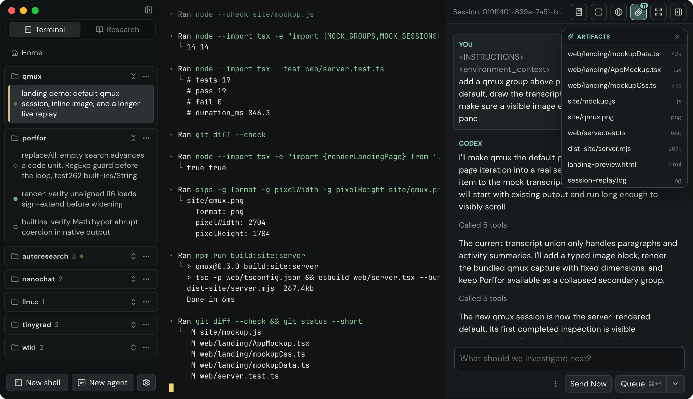

# qmux

qmux is a desktop app for running terminals and coding agents
side-by-side, with vertical tabs and a Cursor-like sidebar for
transcript rendering.

<p align="center"></p>

It has a native UI for launching agents, queueing follow-ups,
tracking agent status, and driving TUI-based agents.

Agents are integrated through a pluggable adapter layer. Claude Code,
Codex, OpenCode, and Grok are included as adapters, each with lifecycle
hooks, native transcripts, session resumes, and native forks. New agents
can be added by implementing the adapter trait in Rust and adding a
matching UI adapter on the frontend.

There is also an adapter for the [Agent Client
Protocol](https://agentclientprotocol.com) (ACP), which is a wire protocol
rather than a specific CLI: any ACP agent — Gemini CLI, Cline, Goose,
OpenHands, Qwen Code, Cursor, and others — is a config entry rather than new
Rust. See [ACP agents](#acp-agents).

## Features

- Native Ghostty terminals: each pane hosts a Metal-rendered Ghostty
  surface on macOS, with a portable Rust PTY backend for tests and
  non-macOS platforms.
- Agent panes for Claude Code, Codex, OpenCode, and Grok, launched from the app
  or by running `claude` / `codex` / `opencode` / `grok` inside a shell pane.
- Agent panes for any ACP agent, configured under `adapters.acp` and launched
  from the app.
- Transcript JSONL tailing and a native follow-up composer: send, queue,
  steer, edit/reorder queued turns, and approve/deny permission prompts where
  supported.
- qMux slash commands in the follow-up composer: `/fork <message>` branches the
  current session, while `/worktree <message>` branches it in a fresh worktree.
  Typing `/` opens an upward command typeahead.
- Session/transcript recovery. Respawns recoverable panes and agents on
  restart, along with drafts that you've typed in qmux.
- Persisted pane, group, agent, transcript, and queued-turn metadata with
  best-effort restart recovery.
- Session forking from inside a running agent session (`qmux fork`),
  supported natively by all four adapters.
- Saved prompt library: prompts as Markdown files with global and
  per-project scopes, `{placeholder}` fill-in, and a `Cmd-K` command
  palette covering prompts, tab navigation, and pane actions.
- App settings: color themes, body font, terminal font and size,
  terminal theme (qmux default plus bundled Ghostty color schemes), mouse
  wheel sensitivity, and a macOS wake lock that keeps the machine awake
  while agents are running (skipped on battery below 10%).
- (Experimental) git worktree creation for launched agents, with configurable
  global, local `.qmux/`, or local `.claude/` storage, dirty-worktree checks,
  and a delete-or-keep prompt when closing worktree-backed panes.
- (Experimental) A tab-bound, resizable browser panel. Token-gated local files
  remain in a sandboxed preview (Markdown renders as styled HTML); normal URLs
  display the isolated browser tab controlled by the active agent.
- (Experimental spike) qmux appears in Codex's `agent.browsers.list()` through
  its current private in-app-browser socket and implements tab, Playwright,
  Computer Use, screenshot, and raw CDP operations through a dedicated
  `chrome-headless-shell` process. qmux finds a bundled or PATH installation,
  then `PLAYWRIGHT_BROWSERS_PATH` and the newest default Playwright cache entry;
  `QMUX_CHROME_HEADLESS_SHELL_PATH` can override discovery. This does not use a
  browser extension or the user's normal browser profile.
- macOS-only at this time. Linux support is planned for the future.

## Install

Requires macOS 13 (Ventura) or later. The DMG is a universal binary and runs
natively on Apple Silicon and Intel Macs.

1. Download the latest `.dmg` from the
   [releases page](https://github.com/raykyri/qmux/releases).
2. Open it and drag **qmux** into **Applications**.
3. You'll want the agent CLIs you use on your `PATH`: `claude`, `codex`,
   `opencode`, and/or `grok`.

If macOS reports the app is damaged or can't be opened, clear the download
quarantine flag and launch it again:

```
xattr -cr /Applications/qmux.app
```

qmux checks the releases page for updates on startup and offers to install
them in place.

## Quickstart

Prerequisites:

- macOS.
- Rust toolchain.
- Node.js and npm.
- The agent CLIs you want to use on `PATH`: `claude`, `codex`, `opencode`, and/or `grok`.

Install dependencies:

```
git submodule update --init
npm install
```

The submodule pins the native GhosttyKit wrapper used by terminal surfaces. Its
checksum-pinned prebuilt framework is downloaded and cached automatically by
SwiftPM on the first Rust/Tauri build; rebuilding Ghostty itself is not required.

Run the app in development:

```
npm run dev:tauri
```

Build the app:

```
npm run build

# Headless build without the Finder-styled DMG window:
CI=true npm run build
```

Ordinary builds do not notarize, even when Apple credentials are present in
`.env`. To build, sign, and notarize release artifacts:

```
npm run build:release
```

Run a release build directly:

```
src-tauri/target/universal-apple-darwin/release/qmux
```

```
open src-tauri/target/universal-apple-darwin/release/bundle/macos/qmux.app
```

Development:

```
# Build the frontend only
npm run build:site:frontend

# Check Rust formatting
cargo fmt --manifest-path src-tauri/Cargo.toml --check

# Check Rust compilation
cargo check --manifest-path src-tauri/Cargo.toml

# Run Rust tests:
cargo test --manifest-path src-tauri/Cargo.toml
```

### Publishing configuration

Transcript and research publishing uses a GitHub OAuth App with Device Flow
enabled and the `gist` scope. The OAuth client ID is public configuration; no
client secret is embedded in qmux.

```
QMUX_GITHUB_CLIENT_ID=<oauth-client-id> npm run dev:tauri
```

Release builds should set `QMUX_GITHUB_CLIENT_ID` at compile time. Published
links default to `https://qmux.app/p/<gist-id>`; set `QMUX_SHARE_BASE_URL` to
override that origin for a development or staging build. `QMUX_GITHUB_TOKEN`
is a non-UI development override for automated testing with an existing token.

The qmux.app server serves the existing landing page at `/` and publications at
`/p/<gist-id>`:

```
npm run build:site:server
HOST=127.0.0.1 PORT=8787 npm run start:site
```

`GITHUB_READER_TOKEN` is optional for the server. When set, it raises the GitHub
API rate limit for publication reads; it is never sent to clients.

Hosted Gist comments use the OAuth App's web flow. Configure its callback URL as
`https://qmux.app/auth/github/callback`, then provide the server-side client
secret and an independent cookie-encryption secret:

```
GITHUB_OAUTH_CLIENT_ID=<oauth-client-id>
GITHUB_OAUTH_CLIENT_SECRET=<oauth-client-secret>
QMUX_SESSION_SECRET=<at-least-32-random-characters>
QMUX_PUBLIC_ORIGIN=https://qmux.app
```

Viewer access tokens are kept in encrypted, HTTP-only session cookies and are
used only to create comments through GitHub's Gist comments API. The comment
body remains readable on GitHub and carries a hidden qmux publication/node
anchor so research-node discussions render in the correct place.

Published research trees also accept structured follow-up proposals. Signed-in
readers can propose a question and optional answer on a published result; the
proposal is stored as a Gist comment. The publication owner can refresh,
accept, or decline proposals from the matching research tree in qmux. Accepting
creates a local child research run, and the next publication sync includes that
result with contributor attribution in `publication.json`, `README.md`, and the
node Markdown file. Owner resolutions remain visible as Gist comments so the
hosted view can show proposal status without a separate collaboration database.

## Using the App

- `Cmd-T`: open a shell pane in code mode; outside code mode, open the agent
  launcher.
- `Cmd-N`: focus Home.
- `Cmd-Shift-R`: switch to Research.
- `Cmd-backtick`: toggle between Terminal and Research.
- `Cmd-=` / `Cmd-+`: increase terminal font size.
- `Cmd--`: decrease terminal font size.
- `Cmd-0`: reset terminal font size.
- `Cmd-1`..`Cmd-9` / `Ctrl-1`..`Ctrl-9`: focus the corresponding pane tab.
- Hold `Cmd`: show floating shortcut hints for Home and pane tabs in the `Cmd-1`..
  `Cmd-9` range.
- `Ctrl-Tab` / `Ctrl-Shift-Tab`: cycle through visible pane tabs across groups.
- `Cmd-Shift-[` / `Cmd-Shift-]`: cycle through Home and open tabs.
- In Research, `Cmd/Ctrl-[` / `Cmd/Ctrl-]` or `Alt-Left` / `Alt-Right`
  navigate response history. Mouse back/forward buttons and horizontal
  two-finger trackpad or mouse-wheel gestures do the same.
- In Research, `Cmd-D`: create a new document (`Cmd-T` starts a new query).
- In Research, `Cmd-J`: jump to the open document's follow-up composer.
- In Research, `Cmd-O`: open or close the research folder menu.
- `Cmd-Shift-T`: switch back to Terminal from Research; otherwise restore the
  most recently closed pane.
- `Cmd-Shift-H`: focus Home.
- `Cmd-Shift-E` / `Ctrl-Shift-E`: expand or restore the active transcript pane,
  or toggle the browser overlay on shell-only panes.
- `Escape`: close the browser overlay when it is open and the key reaches qmux.
- `Cmd-D` / `Cmd-Shift-D`: split the active terminal downward (in Research,
  plain `Cmd-D` creates a new document instead).
- `Cmd-W`: close the active pane.
- `Ctrl-W`: close the active pane unless focus is in a terminal or text field.
- `Cmd-K`: open the command palette (tab navigation, pane actions, saved
  prompts) when focus is outside a terminal.
- Double-tap `Option` (default): open Quick Launch, a standalone
  Spotlight-style popup that dispatches a task to any tab with an agent —
  shell or agent tabs — with the same actions as the right-pane composer:
  Send, Send Now, and Queue with its queue-options dropdown (fork,
  fork-in-worktree, new-session, and queue-after-session targets). Targets
  are listed in a sidebar-style column (status dot, tab name, group) with a
  filter field to narrow them; `Ctrl-Tab` / `Ctrl-Shift-Tab` (or
  `Cmd-Shift-[` / `Cmd-Shift-]`) switch the target without leaving the
  draft, the compose pane shows the selected tab's last exchange (the tail
  of your last message and the agent's reply) with any queued turns
  beneath it, and the launcher reopens on the tab you last dispatched to.
  The popup works from any app, without raising the qmux window. Change the hotkey in Settings between double-tap
  Control/Option/Command and Control/Option/Command-Space (options used by
  the show/hide shortcut are disabled); it is also available from the
  `Cmd-K` palette.
- `Cmd-,` / `Ctrl-,`: open settings.
- In the launcher, enter a prompt, and press `Cmd-Enter` to launch by default
  (`Enter` launches when "Require Cmd-Enter to send" is off).

## How it Works (for agents)

- A pane is one qmux-owned PTY. On macOS its byte stream is rendered by a
  host-managed native Ghostty surface; tests and other platforms use the
  portable renderer path.
- Shell panes spawn `$SHELL`.
- Agent panes spawn the adapter's configured agent binary, either in the current
  repo/directory or in a qmux-created agent worktree. Shell functions can route
  `claude`, `codex`, `opencode`, and `grok` through qmux from shell panes, but the
  adapter binary still needs to be installed or configured.
- Each pane receives:
  - `QMUX_PANE_ID`
  - `QMUX_SOCK`
  - `QMUX_TOKEN`
  - `QMUX_WORKSPACE_ROOT`
- `QMUX_CLI` is also set when the app can resolve the qmux executable, for
  in-pane tooling.
- Agent panes also receive `QMUX_AGENT_ID`.
- Hooks call `qmux notify <event>` over the token-gated Unix socket; qmux routes
  the notification to the owning agent's adapter. The same socket, scoped to the
  caller's pane, serves other in-pane commands such as `qmux fork` and
  `qmux open <file|localhost-url>`.
- A loopback-only (`127.0.0.1`) HTTP server with per-pane random tokens backs
  browser-overlay file targets. It serves only the requesting pane's group,
  current directory, and agent worktree roots.
- Codex Browser-plugin discovery listens on a qmux-owned socket under
  `/tmp/codex-browser-use`. This is an undocumented compatibility adapter and
  may need to track changes in the bundled OpenAI Browser plugin. It defaults to
  the production Codex build flavor; developers can override that metadata with
  `QMUX_CODEX_APP_BUILD_FLAVOR`.
- Transcript tailing starts once an adapter binds a transcript path: Claude via
  `SessionStart`, Codex via an explicit `SessionStart` path or session-id lookup,
  and OpenCode via qmux-managed JSONL.
- Persisted state is written under `<workspaceRoot>/.qmux/state.json`, with normalized
  thread graphs stored separately in `<workspaceRoot>/.qmux/threads/<thread-id>.json`.
  Older worktree-local thread graphs are copied into this global store on startup and
  retained in place as recovery copies.
- Recent terminal output is retained in owner-only per-pane journals under
  `<workspaceRoot>/.qmux/terminal/` and safely replayed before a recovered
  process's startup output.
- `qmux.config.json` keeps dev-build state in a fixed, shared `~/.qmux` dir.
  Only dev (debug) builds discover it in the process cwd; release builds always
  use the platform data dir (`~/Library/Application Support/qmux` on macOS) so
  the session doesn't depend on how the app is launched. Set `QMUX_CONFIG=<file>`
  to point any build at an explicit config:

```json
{
  "workspaceRoot": "~/.qmux/workspaces",
  "socketPath": "~/.qmux/run/qmux.sock",
  "adapters": {
    "claude": { "binary": "claude" },
    "codex": { "binary": "codex" },
    "opencode": { "binary": "opencode" },
    "grok": { "binary": "grok" }
  }
}
```

`~/…` paths expand against `$HOME` and absolute paths are honored verbatim.
Relative paths (for `workspaceRoot`/`socketPath`) are resolved from the config
file's directory when that directory is under `$HOME`; otherwise they fall back to
the platform data/runtime locations. Each adapter's `binary` is optional and
defaults to the command name (`claude`, `codex`, `opencode`, `grok`), which is
looked up on `PATH`; an absolute path or a `~/…` path (expanded against `$HOME`) is
used as given. A top-level `claudeBinary` is still honored for backward
compatibility. If the config file is absent, qmux uses the platform data
directory for workspace state and the platform runtime directory, or a `run/`
subdirectory of the data directory, for the control socket.

### Remote groups

A workspace can be bound to another machine. Remoteness belongs to the group
rather than to an individual agent: the directory, its repository, and every
pane opened against it are one machine's, so binding it at the group level is
what stops an agent ending up somewhere other than the code it is editing.

Machines are declared under `remotes` in `qmux.config.json` and a group is
created against one by passing its id:

```json
{
  "remotes": {
    "devbox": {
      "host": "user@devbox",
      "label": "Dev box",
      "multiplexer": "tmux",
      "qmuxCli": "qmux-cli",
      "workspaceRoot": "/srv/qmux/workspaces"
    }
  }
}
```

`host` is passed to `ssh` verbatim, so `~/.ssh/config` aliases work; everything
else is optional (`label` falls back to the id, `multiplexer` to `tmux`).
`workspaceRoot` is where worktrees live there, since a group's `managedDir` is
always local.

The group **snapshots** the entry it was created against rather than
referencing it, keeping the id only as provenance. Editing or deleting a
`remotes` entry therefore never moves a workspace whose worktrees already live
on the old machine.

Git worktree creation, status, removal, and every repository probe run on the
group's host, and panes are spawned there too: `plan_to_spec` wraps a remote
group's command in `ssh` plus its multiplexer, so this is adapter-agnostic — the
pty still runs one local process, it is just `ssh`.

The multiplexer is what makes a pane survive a dropped connection. Plain `ssh`
cannot: on disconnect sshd closes the pty master and the foreground process
group takes a SIGHUP, and nothing in `ssh` buffers output for an absent client
or lets a new connection re-attach to an old process's stdio. With `tmux`, panes
run under `tmux new-session -A -s qmux-<pane>`, so the same command line starts
a session the first time and reattaches to it afterwards. `herdr` is recognised
but not yet driveable — its attach-or-create invocation isn't something to
guess at, since a wrong flag would start a second session on every reconnect
rather than reattaching — so a herdr group refuses to launch and says so.

Two things a remote group cannot do yet, both refused rather than half-done.
Shell panes: their integration is delivered as files written to the local
filesystem and referenced by `ZDOTDIR`, and on the far side those paths don't
exist, so a shell would come up silently missing cwd reporting and the agent
wrappers. And every adapter except ACP: they resolve their binary against the
local `PATH`, point flags at locally-materialized plugin directories, and rely
on the pane's cwd being the worktree — all of which start fine over there and
are then wrong in ways that look like the agent misbehaving. Adapters opt in
through `AgentAdapter::supports_remote` once they've been checked for all
three.

### ACP agents

The `acp` adapter speaks the [Agent Client
Protocol](https://agentclientprotocol.com) instead of driving one vendor's
TUI, so agents are declared in config rather than compiled in:

```json
{
  "adapters": {
    "acp": {
      "defaultAgent": "gemini",
      "agents": {
        "gemini": { "name": "Gemini CLI", "command": "gemini", "args": ["--experimental-acp"] },
        "goose":  { "name": "Goose", "command": "goose", "args": ["acp"] }
      }
    }
  }
}
```

Each entry needs a `command` (looked up on `PATH`, or an absolute/`~/…` path);
`name`, `args`, and `env` are optional. `defaultAgent` picks the one a launch
without an explicit choice gets, and is unnecessary when only one agent is
configured. Consult your agent's own docs for the flag that puts it in ACP
mode — it is not standardized.

Agents can also be added from the published [ACP
registry](https://agentclientprotocol.com/get-started/registry) instead of being
written out by hand. qmux reads the registry index, shows what it can run, and
pins the resolved command line into its own store (`.qmux/acp-agents.json`) —
`qmux.config.json` is yours and qmux never writes to it. A hand-written entry
always wins over a registry one with the same id.

Only the `npx` and `uvx` distribution channels are supported, which is 23 of the
38 agents currently listed; those need no install because the package manager
fetches on demand. Agents shipping only a prebuilt binary are listed with the
reason they're unavailable rather than hidden. Note that adding an agent this
way records a command line but downloads nothing — the package is fetched and
executed by `npx`/`uvx` the first time you launch that agent.

The process qmux runs in the pane is `qmux acp`, a bridge that is an ACP client
on one side and an ordinary qmux agent on the other. ACP agents have no TUI —
the protocol makes the *client* responsible for rendering, the filesystem,
permissions, and terminals — so the bridge supplies all four: it renders the
session as text, takes prompts on stdin (which is how the follow-up composer
delivers turns), writes the transcript the sidebar tails, and reports status
through the usual lifecycle hooks. Ctrl-C sends `session/cancel`.

Notable properties and limits:

- `terminal/create` runs commands on a real pty, so anything checking `isatty`
  behaves the way it does for a human rather than taking its piped-output
  branch.
- Elicitation is supported in both modes. A form is filled in field by field in
  the pane, with enums numbered, defaults pre-filled, and `/decline` and
  `/cancel` distinguished — agents are required to branch on which they got. A
  URL elicitation shows the full link, warns about plain HTTP, punycode
  domains, and embedded credentials, and opens it in the qmux browser overlay
  only after you say yes; the overlay's isolated tab is the "context the client
  and the agent's model cannot inspect" the spec asks for. ACP forbids
  collecting secrets through a form — that is what URL mode is for — so a form
  asking for something that looks like a token or password is flagged before
  you answer it.
- Session config options are displayed but not yet settable. An agent's `model`
  and `thought_level` show up as the pane's model and effort; changing them
  from qmux is not wired up.
- Follow-ups queue rather than steer. ACP has one `session/prompt` per turn and
  no mid-turn steering; `session/cancel` is the only in-flight control.
- Resume is best-effort: `session/load` is an optional agent capability, and
  the bridge starts a fresh session (saying so in the pane) when it is refused.
- No shell-command integration — ACP agents are launched from qmux, not by
  typing their name in a shell pane.
- No fork. The protocol has no branch operation, so `/fork` and per-message
  forking are hidden for ACP sessions.

## License

MIT (C) 2026
